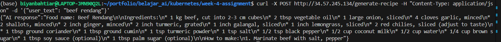

# Week 4 Assignment
Aplikasi pembuat resep sederhana dengan memanfaatkan Gemini API

## Step:
1. Install poetry dan init
2. poetry add:
    python = "^3.12"
    marimo = "^0.9.27"
    python-dotenv = "^1.0.1"
    google-generativeai = "^0.8.3"
    flask = "^3.1.0"
3. Buat generate_recipe.py, tes di marimo
4. Setelah berhasil, buat app.py untuk backend Flasknya, coba run di local
5. Setelah berhasil, buat Dockerfile
6. Coba build dan run Dockerfile
7. Setelah berhasil, buat repo github
8. Buat trigger cloud build, connect ke repo yang telah dibuat, buat trigger ketika push ke branch main
9. Buat kubernetes cluster: gcloud container clusters create w4assignment-cluster --num-nodes=1 --zone=us-central1 --disk-type=pd-standard
10. Buat cloudbuild.yaml, service.yaml dan deployment.yaml
11. git add, commit dan push ke main
12. Setelah cloudbuild selesai, cek eksteral IP di kubectl get services
13. Prompt message menggunakan curl -X POST http://34.57.245.134/generate-recipe -H "Content-Type: application/json" -d '{"user_text": "beef rendang"}

Berikut hasilnya: 

